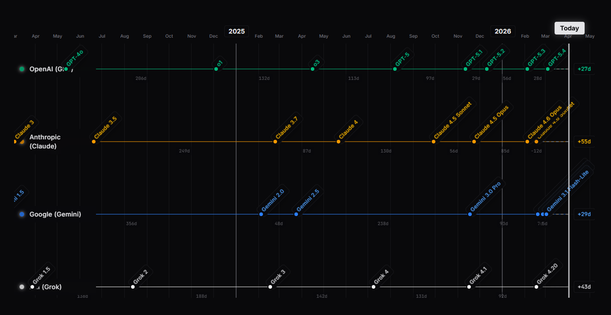

# AI Model Release Timeline

A shareable web app that maps major AI foundation model releases and coding harnesses (agentic coding tools) across providers onto one chronological timeline.

Live site: https://kvick-games.github.io/AI_Model_Timeline_Website/

## Overview

The app presents model launches on a single horizontal timeline so you can compare release cadence across companies and product lines at a glance. It includes:

- company rows that expand into compact product-line lanes when multiple selected lines are active
- product-line filters for frontier LLMs, open-source LLMs, coding harnesses, image generation, video generation, and 3D generation
- month and year guides across the full timeline
- zoom controls for dense sections of the chart
- gap labels showing the number of days between releases
- a live "Today" marker to show time since the latest release

## Tech stack

- React 19
- Vite
- Tailwind CSS
- Motion
- TypeScript

## Local development

1. Install dependencies: `npm install`
2. Start the dev server: `npm run dev`
3. Build for production: `npm run build`

## GitHub Pages deployment

This repo includes a GitHub Actions workflow that builds the Vite app and publishes the `dist` output to GitHub Pages.

1. Push the repo to GitHub.
2. In GitHub, open `Settings` -> `Pages`.
3. Set the source to `GitHub Actions`.
4. Push to `main` or run the `Deploy GitHub Pages` workflow manually.

The Vite config is set up so repository Pages deployments use the correct base path automatically.
