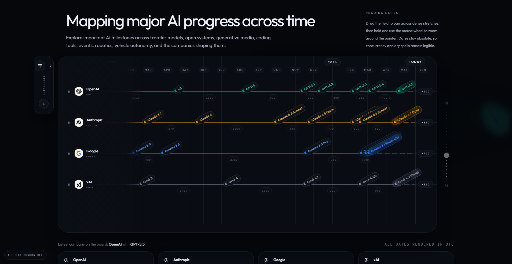

# AI Model Release Timeline

A shareable web app that maps major AI foundation model releases, coding harnesses, creative systems, events, and robotics milestones across providers onto one chronological timeline.

Live site: https://kvick-games.github.io/AI_Model_Timeline_Website/

## Features

The app presents model launches on a single horizontal timeline so you can compare release cadence across companies and product lines at a glance. It includes:

- provider rows that expand into compact product-line lanes when multiple selected lines are active
- filter groups for frontier LLMs, open-source systems, Mistral, coding harnesses, creative generation, events, robotics, and vehicle autonomy
- draggable, pannable, and zoomable timeline navigation for dense release windows
- month and year guides across the full timeline, plus a live "Today" marker
- gap labels showing the number of days between releases or events
- multi-day event ranges for livestreams, conferences, showcases, and other dated industry moments
- article panels for notable releases and events, with source links, official logo marks, and event-specific calendar icons
- current Cursor Composer coverage, including Composer 1, 1.5, 2, 2.5, and the Cursor / SpaceXAI partnership event
- official provider logos for OpenAI, Anthropic, Google, xAI, Figure, Tesla, and Cursor
- grayscale shader treatment behind the timeline widget so the background art stays readable under the board

## Tech stack

- React 19
- Vite
- Tailwind CSS
- Motion
- TypeScript

## Local development

1. Install dependencies: `npm install`
2. Start the dev server: `npm run dev`
3. Build for production: `npm run build`

## GitHub Pages deployment

This repo includes a GitHub Actions workflow that builds the Vite app and publishes the `dist` output to GitHub Pages.

1. Push the repo to GitHub.
2. In GitHub, open `Settings` -> `Pages`.
3. Set the source to `GitHub Actions`.
4. Push to `main` or run the `Deploy GitHub Pages` workflow manually.

The Vite config is set up so repository Pages deployments use the correct base path automatically.
