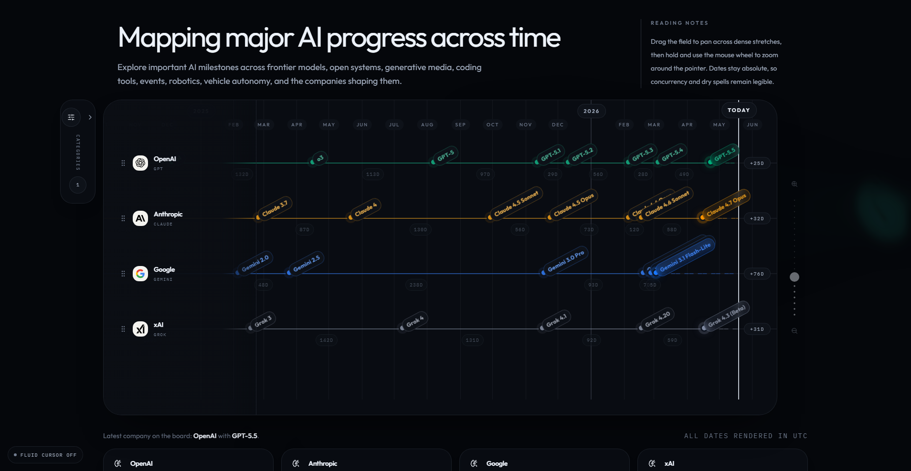

# AI Model Release Timeline

A shareable web app that maps major AI foundation model releases, coding harnesses, creative systems, events, and robotics milestones across providers onto one chronological timeline.

Live site: https://kvick-games.github.io/AI_Model_Timeline_Website/

## Features

The app presents model launches on a single horizontal timeline so you can compare release cadence across companies and product lines at a glance. It includes:

- provider rows that expand into compact product-line lanes when multiple selected lines are active
- filter groups for frontier LLMs, open-source systems, Mistral, coding harnesses, creative generation including audio, voice models, events, robotics, and vehicle autonomy
- draggable, pannable, and zoomable timeline navigation for dense release windows
- month and year guides across the full timeline, plus a live "Today" marker
- gap labels showing the number of days between releases or events
- multi-day event ranges for livestreams, conferences, showcases, and other dated industry moments
- article panels for notable releases and events, with source links, official logo marks, and event-specific calendar icons
- current Cursor Composer coverage, including Composer 1, 1.5, 2, 2.5, the Cursor / SpaceXAI partnership, the Composer -> Grok Composer acquisition marker, the mirrored Grok Build rebrand marker, and SpaceX/SpaceXAI/Cursor acquisition events
- official provider logos for OpenAI, Anthropic, Google, SpaceXAI, SpaceX, Figure, Tesla, and Cursor
- grayscale shader treatment behind the timeline widget so the background art stays readable under the board

## Tech stack

- React 19
- Vite
- Tailwind CSS
- Motion
- TypeScript

## Timeline library

The reusable timeline renderer is consumed from `@kvick-games/timeline-library`, pinned to a GitHub tag. The current AI model site is an adapter in `src/data/aiTimelineDefinition.ts` that passes grouped timeline data, facets, event types, copy, scoring, article index data, and logo assets into `TimelineExperience`.

To create a new timeline around different content, build a new `TimelineDefinition` with your own groups, lanes, dated items, filter groups, labels, scoring, and article index, then render `<TimelineExperience definition={yourDefinition} />`.

## Local development

1. Install dependencies: `npm install`
2. Start the dev server: `npm run dev`
3. Build for production: `npm run build`

## Codex automation

The repo includes a durable Codex automation prompt at `.codex/automations/ai-news-maintenance.md`. Use it to create a Codex project automation that checks for major AI model releases and high-signal AI industry updates around 10am and 4pm America/Los_Angeles every day.

Recommended Codex automation setup:

1. Create a project automation from the Codex app.
2. Use a dedicated background worktree so scheduled edits stay separate from local work.
3. Use the prompt in `.codex/automations/ai-news-maintenance.md`.
4. Schedule two daily runs: 10:00 AM and 4:00 PM America/Los_Angeles.

When a run finds a source-backed update that clears the significance bar, Codex should update the timeline data, add article files as needed, run `npm run lint` and `npm run build`, then prepare a draft pull request. If nothing clears the bar, the automation should report that no PR is needed.

## Director mode

Use the **Director** button in the timeline to build a record-ready update showcase. The studio selects nodes from the last 14 days by default, supports manual node selection, and previews landscape, vertical, or square social formats. Choose a pace, edit the headline, copy the generated post caption, then play the automated camera tour and record the clean stage with your preferred screen recorder.

Keyboard controls during a showcase: Space pauses or resumes, Left and Right move between scenes, and Escape exits Director mode.

## GitHub Pages deployment

This repo includes a GitHub Actions workflow that builds the Vite app and publishes the `dist` output to GitHub Pages.

1. Push the repo to GitHub.
2. In GitHub, open `Settings` -> `Pages`.
3. Set the source to `GitHub Actions`.
4. Push to `main` or run the `Deploy GitHub Pages` workflow manually.

The Vite config is set up so repository Pages deployments use the correct base path automatically.
